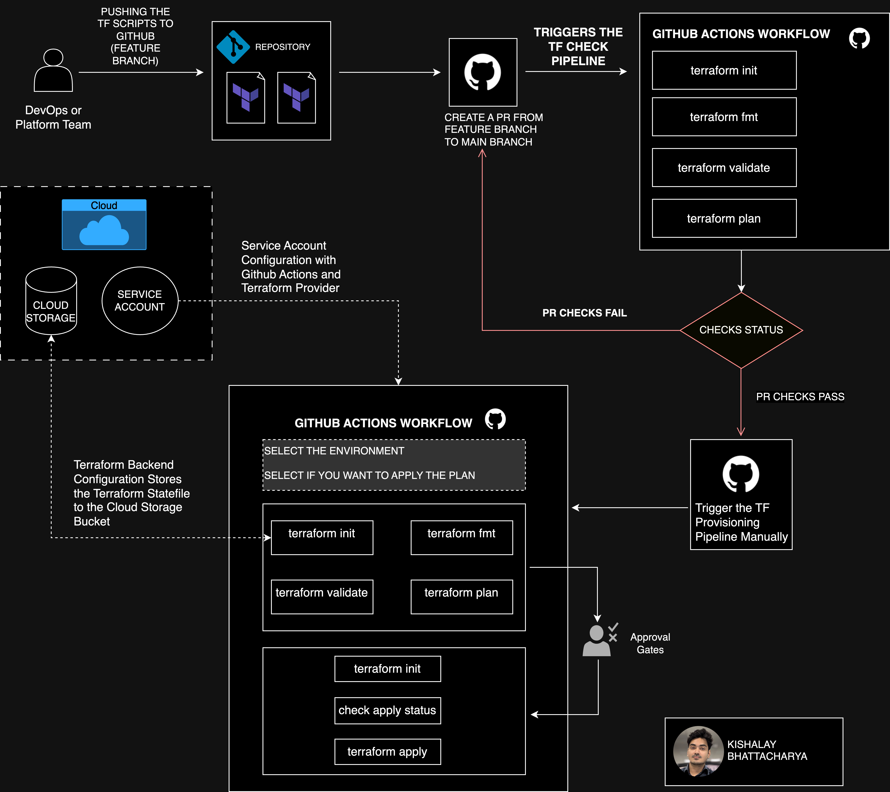

# Terraform Provisioning with Github actions

## Workflow diagram

## Workflows
### 1. PR Check
This workflow will get trigger everytime a PR has been raised for the main branch. 

Steps
- terraform init
- terraform fmt
- terraform validate
-  terraform plan -var-file="env/.tfvars"

### 2. Apply Workflow
This is a manually trigger workflow with environment protection rule for terraform apply which require a manual approval from specific reviewers.  

This step require two pipeline variables, 
- env : to select the environment from the drop down
- approval status: should be true for apply changes

Steps
- terraform init
- terraform fmt
-terraform validate
- terraform plan -var-file="env/dev.tfvars"
- approval for apply stage
- terraform apply -var-file="env/.tfvars" --auto-approve

